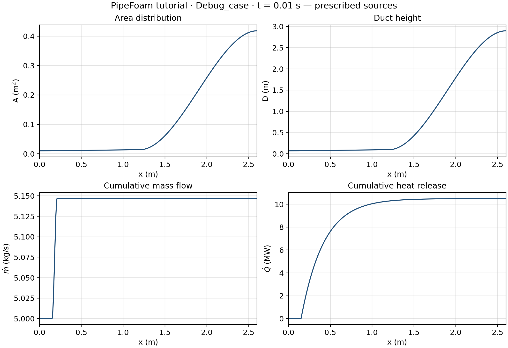
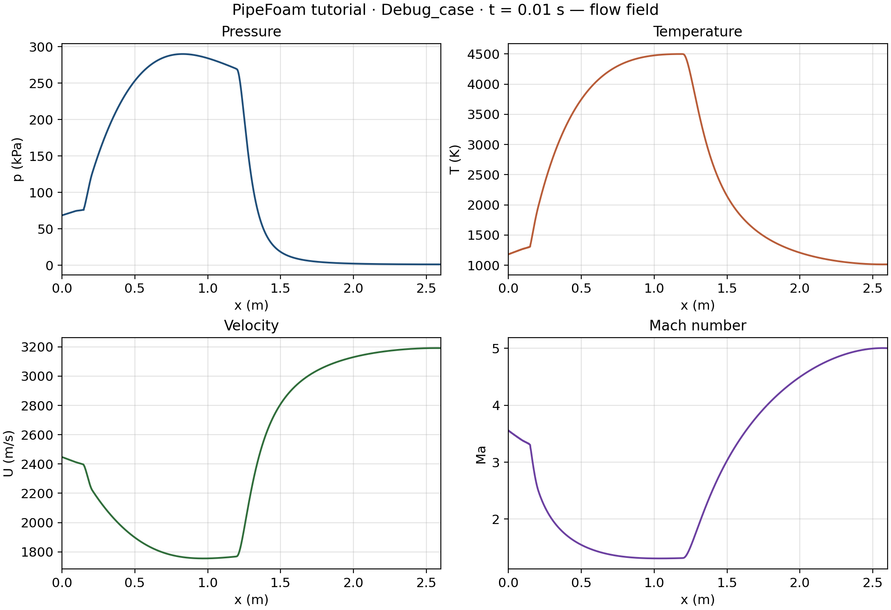

# PipeFoam

PipeFoam is a transient compressible solver for quasi-1D duct flow, derived from OpenFOAM v2406 `sonicFoam`. It keeps the original PIMPLE / density-based loop and adds the extra terms needed for a variable-area combustor and nozzle: prescribed area $A$, wall friction $f/D$, cumulative heat release $\dot{Q}$, and cumulative mass injection $\dot{m}$.

The mesh itself is a dummy constant-section box. The physical duct area is a field. Convection uses the face-interpolated area $A_f$. Fuel is injected with a prescribed streamwise velocity $v_f$ and sensible energy $e_f$. Wall friction appears only in the momentum equation.

$\dot{m}(x)$ and $\dot{Q}(x)$ are **cumulative** along the duct, so the local sources are $\partial\dot{m}/\partial x$ and $\partial\dot{Q}/\partial x$.

## Governing equations

Continuity, streamwise momentum and energy are written in conservative quasi-1D form. $e$ is the sensible internal energy and $K=\lvert\mathbf{U}\rvert^2/2$.

$$
\frac{\partial}{\partial t}(\rho A)
+\frac{\partial}{\partial x}(\rho u A)
=\frac{\partial\dot{m}}{\partial x}
$$

$$
\frac{\partial}{\partial t}(\rho u A)
+\frac{\partial}{\partial x}(\rho u^{2} A)
=-A\frac{\partial p}{\partial x}
+v_f\frac{\partial\dot{m}}{\partial x}
-2\rho u\lvert u\rvert A\frac{f}{D}
$$

$$
\frac{\partial}{\partial t}\bigl[\rho(e+K)A\bigr]
+\frac{\partial}{\partial x}\bigl[\bigl(\rho(e+K)+p\bigr)u A\bigr]
=\bigl(e_f+\tfrac{1}{2}v_f^{2}\bigr)\frac{\partial\dot{m}}{\partial x}
+\frac{\partial\dot{Q}}{\partial x}
$$

Density follows the perfect-gas / `psiThermo` relation $\rho=\psi p$. The tutorial case is laminar with $\mu=0$.

An example case (`Debug_case`) is a hydrogen-fueled scramjet combustor followed by a 30:1 nozzle, $x=0$–$2.6\,\mathrm{m}$. Inlet air is $5\,\mathrm{kg/s}$ at $\mathrm{Ma}\approx 3.56$; fuel adds $0.147\,\mathrm{kg/s}$; heat release is $10.5\,\mathrm{MW}$, below the constant-area Rayleigh limit, so the duct stays supersonic.

## Example flow field

Results below are from `Debug_case` at $t=0.01\,\mathrm{s}$. Heat addition raises $p$ and $T$ and brings Mach down to about $1.31$. The jump at $x=1.2\,\mathrm{m}$ is the nozzle expansion, not a shock. Exit Mach is about $5.0$.

| | Inlet | Combustor | Exit |
| --- | ---: | ---: | ---: |
| $A$ | $0.0101\,\mathrm{m}^{2}$ | — | $0.418\,\mathrm{m}^{2}$ |
| $p$ | $68.5\,\mathrm{kPa}$ | $290\,\mathrm{kPa}$ at $x=0.83\,\mathrm{m}$ | $1.12\,\mathrm{kPa}$ |
| $T$ | $1180\,\mathrm{K}$ | $4500\,\mathrm{K}$ at $x=1.18\,\mathrm{m}$ | $1014\,\mathrm{K}$ |
| $U$ | $2447\,\mathrm{m/s}$ | min $1755\,\mathrm{m/s}$ | $3192\,\mathrm{m/s}$ |
| $\mathrm{Ma}$ | $3.56$ | min $1.31$ | $5.00$ |

